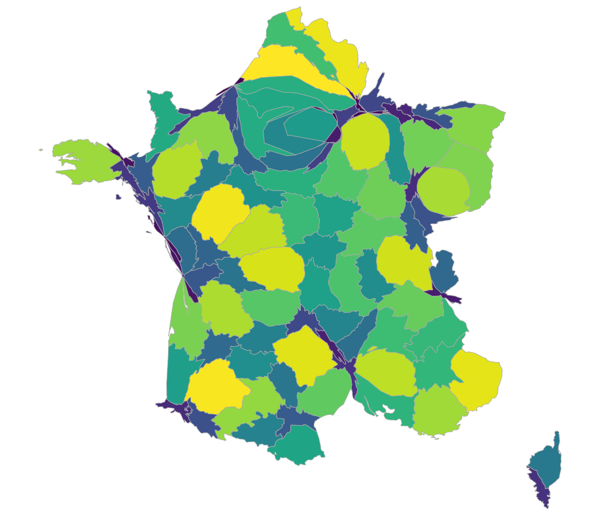

# topogRam

> Cartogram htmlwidget for visualizing geographical data by distorting a TopoJson topology (using [cartogram-chart](https://github.com/vasturiano/cartogram-chart))

[](https://travis-ci.org/pvictor/topogRam)
[](http://www.repostatus.org/#active)


### Installation

Install from GitHub:

```r
# with remotes
remotes::install_github("pvictor/topogRam")

# or with install-github.me service (based on remotes)
source("https://install-github.me/pvictor/topogRam")

# or with devtools:
devtools::install_github("pvictor/topogRam")
```

### Examples

Use a {sf} object as input :

```r
library( rnaturalearth )
library( topogRam )

# sf polygons
fr_dept <- ne_states(country = "france", returnclass = "sf")
fr_dept <- fr_dept[fr_dept$type_en %in% "Metropolitan department", ]

# Add a numeric column
fr_dept$foo <- sample.int(100, nrow(fr_dept))

# Create cartogram
topogRam(
  shape = fr_dept, 
  value = "foo"
)
```




```r
library( rnaturalearth )
library( eurostat )
library( sf )
library( topogRam )

# Get polygons
europe <- ne_countries(scale = 50, continent = "europe", returnclass = "sf")
europe <- europe[europe$name %in% eu_countries$name, ]
europe <- st_crop(europe, xmin = -20, ymin = 10, xmax = 35, ymax = 75)
# plot(sf::st_geometry(europe))

# Add a numeric column 
europe$foo <- sample.int(100, nrow(europe))

# Create cartogram
topogRam(
  shape = europe, 
  value = "foo", 
  tooltip_label = ~name, 
  n_iteration = 10, 
  palette = "Blues"
)
```


### Note

The use of `cartogram-chart` has involved many changes, so that previous features are no longer available.


