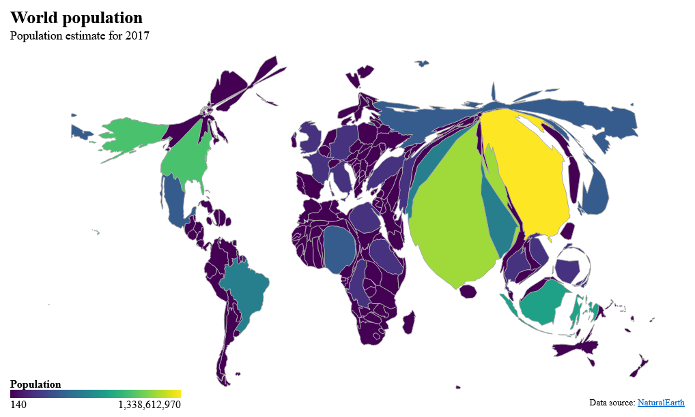

# topogram

> Cartogram htmlwidget for visualizing geographical data by distorting a TopoJson topology, using [cartogram-chart](https://github.com/vasturiano/cartogram-chart)

<!-- badges: start -->
[](http://www.repostatus.org/)
<!-- badges: end -->


### Installation

Install from [GitHub](https://github.com/dreamRs/topogram):

```r
remotes::install_github("dreamRs/topogram")
```


### Overview



Created with:

```r
library(topogram)
world %>% 
  topogram( 
    value = "pop_est", 
    label = "{name}: {format(pop_est, big.mark = ',')}",
    palette = scales::col_bin(, bins = 20, domain = NULL)
  ) %>% 
  topogram_legend(
    title = "Population",
    formatter = scales::label_comma()
  ) %>% 
  topogram_labs(
    title = "World population",
    subtitle = "Population estimate for 2017",
    caption = "Data source: NaturalEarth"
  )
```

More examples in the [{pkgdown} website](https://dreamrs.github.io/topogram/)

