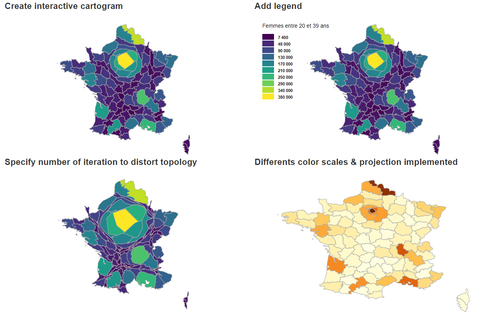

# topogram

> Cartogram htmlwidget for visualizing geographical data by distorting a TopoJson topology (using [cartogram-chart](https://github.com/vasturiano/cartogram-chart))

<!-- badges: start -->
[](https://travis-ci.org/dreamRs/topogram)
[](http://www.repostatus.org/#active)
<!-- badges: end -->


### Installation

Install from GitHub:

```r
remotes::install_github("dreamRs/topogram")
```


### Features





### Examples

Use a {sf} object as input :

```r
library(rnaturalearth)
library(topogram)

# sf polygons
fr_dept <- ne_states(country = "france", returnclass = "sf")
fr_dept <- fr_dept[fr_dept$type_en %in% "Metropolitan department", ]

# Add a numeric column
fr_dept$foo <- sample.int(100, nrow(fr_dept))

# Create a cartogram
topogram(
  shape = fr_dept, 
  value = "foo"
)
```


```r
library(rnaturalearth)
library(eurostat)
library(sf)
library(topogram)

# Get polygons
europe <- ne_countries(scale = 50, continent = "europe", returnclass = "sf")
europe <- europe[europe$name %in% eu_countries$name, ]
europe <- st_crop(europe, xmin = -20, ymin = 10, xmax = 35, ymax = 75)
# plot(sf::st_geometry(europe))

# Add a numeric column 
europe$foo <- sample.int(100, nrow(europe))

# Create a cartogram
topogram(
  shape = europe, 
  value = "foo", 
  tooltip_label = ~name, 
  n_iteration = 10, 
  palette = "Blues"
)
```


### Markdown

You can pass several column names, in that case a dropdown menu is added to the widget to select the variable used to distort topology. Use this in markdown to add interactivity.

An example in an R markdown document is availabe here : https://pvictor.github.io/NZ-topogram/ and another one here : https://pvictor.github.io/cartogramme-vin/


### Shiny

A proxy method is implemented to update an existing cartogram with classic Shiny inputs.


